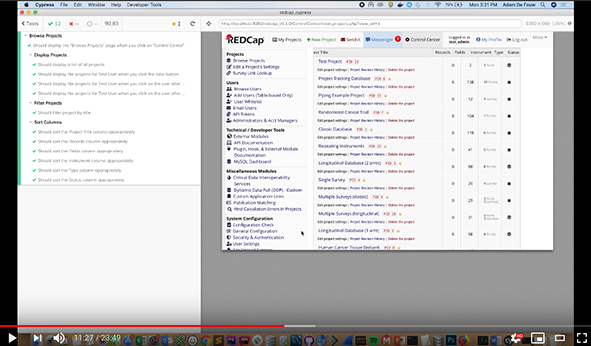
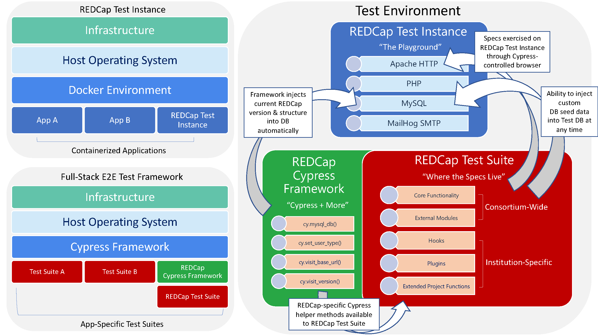

# REDCap Cypress Test Framework

This repository is a template to assist you in writing **automated tests for REDCap**.  

It is intended to serve as a starting point for writing your own integration and regression tests, which can be used to validate the features and functionality of your REDCap environment.

Core REDCap features are being added to the core feature suite under an automated testing initiative that is guided by the Regulatory & Software Validation committee.

# Overview
- [Quick Start Guide](https://github.com/aldefouw/redcap_cypress/wiki)
- [Configuration Tutorial Video](#configuration-tutorial-video)
- [Why Test REDCap?](#why-test-redcap)
- [Manual Testing](#manual-testing)
- [Automated Testing](#automated-testing)
- [Why Cypress?](#why-cypress)
- [Getting Started](#getting-started)
- [Defining Your Test Environment](#defining-your-test-environment-variables)
- [Test Database Structure & Seeds](#test-database-structure--seeds)
- [Writing Your Tests](#writing-your-tests)
- [Sharing Your Tests](#sharing-your-tests)
- [Running Your Tests](#running-your-tests)
- [Known Limitations and Areas for Improvement](#known-limitations--areas-for-improvement)

## Configuration Tutorial Video

If you learn by watching, the video tutorial is probably the quickest way to get up and running.  

The video also includes information regarding how to contribute to this project directly.  ***Thus, the video is highly recommended viewing.***

**Click the image to begin playing:**

## Why Test REDCap?

As REDCap administrators, we all have a common goal: 

*To provide our end users with a secure and trusted environment to capture data.*

### A Great Start

The good news is that REDCap is a great start for all of us.  There's no doubt it's a proven and stable platform.

Even so - it's still software.  

Changes and bugs can creep in without notice.  This is especially true if your institution has custom functionality configured through hooks, plugins, or modules.

**Thus, as REDCap administrators, there are some basic questions we must ask, such as:**
- *Will an upgraded REDCap version function as expected?*
- *Will an upgraded REDCap version break our existing hooks, plugins, and modules?*

But simply asking the question is not enough.  

*Until we perform some kind of test against an instance of REDCap, we do not know the answers to the above questions.*

To test REDCap, most of us have resorted to manual testing for reassurance that REDCap is doing what we think it should.

## Manual Testing

Manual testing has served many of us very well.  In fact, a major advantage to manual testing is that it's easy to do and has a low barrier to entry.

However, manual testing still has some inherent challenges and drawbacks.

Those challenges include, but are not limited to, the following:

---
### Manual Testing Challenges
1. **Time** - it takes a lot of time to test all features
2. **Tediousness** - it is extremely tedious to click through the application
3. **Consistency** - it is hard to test everything in a consistent manner
---

Even without this simple analysis, no one needs to tell you that manual testing takes a lot of effort.

Is there a better way?

## Automated Testing

If you'd like to escape the tedious, time-intensive, consistency-deprived process of manual testing, **automated testing is your answer**.

In fact, *each one of the challenges with manual testing is either significantly alleviated or solved by automated testing*.

---
### Automated Testing Benefits
1. **Time** - automated tests are much faster than manual testing because a computer is performing the task and not a human
2. **Tediousness** - automated tests are run by computers, which are built to do tedious work that humans dislike
3. **Consistency** - automated tests run the same way, each and every time
---

*Automated tests leverage what computers are good at to reduce or eliminate the problems of time, tediousness, and consistency associated with manual testing.*

## Why Cypress?
**This template uses the Cypress framework**, a JavaScript library which allows non-environment-dependent testing.  

**The choice to use Cypress for testing REDCap was strategic.**  

Because the framework is not environment-dependent, **the tests you write today will still be relevant in the future** - even if you change your server infrastructure.  

*You could change from Windows to Linux or vice versa and your tests won't need to change.*

The non-platform-dependent nature of Cypress tests also opens the door for consortium members to share tests with other members of the REDCap consortium. 

## Getting Started

Please read our [Quick-Start Guide](https://github.com/aldefouw/redcap_cypress/wiki#quick-start-guide) in the wiki if you are new to the framework.

### Automated Testing Requirements

Automated testing of REDCap requires two things:
- REDCap Test Instance (in most cases, [Docker REDCap Instance](https://github.com/aldefouw/redcap_docker) )
- REDCap Cypress Test Framework (this repository)

The combination of the REDCap Test Instance and the Test Framework is considered your "Test Enivronment."

---

### Test Environment

What is the test environment?  It might be easier to show you than to tell you.  

The graphic below is a visual representation of the test environment.  

In essence, the test environment is a combination of both the REDCap Test Instance you run and the REDCap Cypress Test Framework (e.g. this repository) that you write your tests in.

Wondering what you need configured for a REDCap Test server?

- **It can be located anywhere:** *local or remote*.  
- **It can run in any environment:** *virtualized or dedicated*.  
- **It can run any OS you want:** *Linux or insert your favorite OS here*.

There are really only **two requirements for your REDCap Test Instance**:
1. *It must be running prior to starting the test suite tests*
2. *It must be accessible through HTTP protocol via the test suite*

If your REDCap Test Instance is running and functional, this part is done.  However, setting up your REDCap Test Instance is only half of what you need to create a Test Environment.  

The other half necessary is to configure your Test Framework, which is covered below.

### CAUTION:
*Although the Cypress test framework can test against any server through HTTP protocol, **please do NOT use your production server as your test environment**.  You might think the best way to test your REDCap instance is to test against your actual server that people store data on.  That simply isn't the case.*

*The best test suites reset database state to a known configuration before running tests. That isn't something you should ever do (or ever want to do) against production!*

*The best way to test your REDCap instance is to configure an environment identical to production somewhere else.  An easy way to do this is through Docker.*

Although configuring your environment is outside the scope of this document, there are several consortium members who have successfully configured Docker containers.  

**If you need help getting started with Docker, you can use the following repository as a starting point: [REDCap Docker](https://github.com/aldefouw/redcap_docker) repository.  Please note that this repository requires the REDCap source files to be on your machine.**

---
### Test Framework 

In short, this is the repository you're looking at.  You will write tests on your machine and then run them against your Test Environment.

If you have a **REDCap Test Instance** running and you've cloned this repository (your **Test Framework**), you are now ready to configure and define your test environment.

---

## Defining Your Test Environment Variables

### Tell your Test Framework about your Test Environment

Configuring your environment is simultaneously the most crucial and difficult step to complete.  

You will need to define several environment variables.

### Environment Variables

Cypress will understand your environment only if you describe it accurately.  

Your description will live inside an environment variable definition file.  

**You will need to set the variables in this file in order for your test suite to function.**

Let's get started by creating a `cypress.env.json` file.

### cypress.env.json

In the root of this repository, create a file named `cypress.env.json`.  

To get you started, an example file named `cypress.env.json.example` is included within this repository.  

Here is an example environment variable setup:

    {
      "users": {
        "admin": {
          "user": "admin_user",
          "pass": "Testing123"
        },
        "standard": {
          "user": "test_user",
          "pass": "Testing123"
        }
      },
      "redcap_version": "9.1.3",
      "redcap_source_path": "../redcap-source",
      "mysql": {
        "host": "127.0.0.1",
        "path": "mysql",
        "port": "3306",
        "db_name": "redcap",
        "db_user": "root",
        "db_pass": "root"
      }
    }

Below are descriptions of the configuration variables shown above.

---
### users ###
The JSON array that contains the users who are seeded in the `seeds.sql` file.  

Each user key contains a username (user) and password (pass).  

You can login with an admin user versus a standard user depending on what functionality you are trying to test.

You can specify what user is currently logged in (within your tests themselves - the configuration simply specifies the user credentials for these users) using the built-in method #set_user_type.

For instance:

`cy.set_user_type('standard')`

`cy.set_user_type('admin')`

---
### redcap_version ###
The version of REDCap that you are testing against.  This is a critical value to set so that Cypress knows the correct URLs to use when testing.

---
### mysql ### 
The JSON array that contains several keys, which are critical for your database structure and seeds to be populated correctly before each and every test spec.  

(See **Database Structure & Seeds** section for more information about how these work.)

---
### mysq['host'] ### 
The hostname or IP address of your MySQL database host.  

For many of us, this will likely be either `localhost` or `127.0.0.1`.  Keep in mind that there are subtle nuances between `localhost` and `127.0.0.1`.  Thus, you need to choose the option best-suited to your environment.

---
### mysql['path'] ### 
The path to your mysql binary.  

For many of us, this will probably be `mysql`, but you could also use a full path like `/usr/local/opt/mysql@5.7/bin/mysql` if necessary.  If you are on a Unix-like environment, you can often determine your full path by entering `which mysql` at the terminal window.

---
### mysql['port'] ### 
The port to your MySQL instance.  

This is usually `3306` on standard setups, but for many of us running Docker instances we may wish to use an alternative port so we can differentiate between the standard MySQL instance that is installed on a local operating system and the Docker instance itself.

---
### mysql['db_name'] ### 
The name of your MySQL REDCap database.  

This is typically `redcap` but not always.  You'll want to check your `database.php` file on your test instance of your REDCap installation to determine this value.

---
### mysql['db_user'] ### 
The username of your MySQL REDCap database user.  

This is typically `root` on local instances of MySQL or local Docker containers.  You'll want to check your `database.php` file on your test instance of your REDCap installation to determine this value.

---
### mysql['db_pass'] ### 
The password of your MySQL REDCap database user.  

This is typically `root` on local instances of MySQL or local Docker containers.  You'll want to check your `database.php` file on your test instance of your REDCap installation to determine this value.

---

## Test Database Structure & Seeds

Database configuration happens in two phases:
1. Configuration of REDCap Structure
2. Population of REDCap Seed Data

### Configuration of REDCap Structure & Population of REDCap Seed Data
To create non-deterministic tests, we want to reset the database state to a known state before the test suite is run.

Before the test suite is run, the appropriate tables for your specified REDCap version are installed into your MySQL database.  To achieve this, the framework needs to know about where your REDCap source code is located.

You will need the following environment variables configured in your cypress.env.json file:

- `"redcap_source_path": "../path/to/redcap/source/here"`: 
Contains the relative or absolute path to your REDCap source folder root (files from Vanderbilt).  Must contain the version-specific files for the version you wish to tests against.

- `"redcap_version": "9.1.3"`: Contains the string version of REDCap you want to test against.  

*The seeds file in this template repository also include a both an **admin user** and a **standard user.***  

Which user you use to login to REDCap is dependent upon what kind of feature you are intending to test.

### Adding A Custom Seed

You can create any database state you want to prior to running your tests.  The included `seeds.sql` file is an example to get you started.

It is possible to add your own custom seed data.  To add custom seed data, do the following:

1. Add a custom `your_custom_seed_name_here.sql` file into the `/test_db/` folder.  

2. Ensure that your custom SQL file is wrapped in a TRANSACTION and that specifies the correct database.

To ensure it is using the correct database, please make sure to include the following line within your transaction code:

        USE `REDCAP_DB_NAME`;

(**Note:** The above value is replaced via Regular Expression in the shell script.  You should enter it as the static value above - NOT as your custom database name.)

3. Reference that file in the beforeEach() block within the `/support/index.js` file.

For example:

      ....

      before(() => {
          //Create the initial database structure
          cy.mysql_db('structure');
      });

      beforeEach(() => {
          //Set the Base URL in the REDCap Configuration Database
          const base_url = 'BASE_URL/' + Cypress.env('baseUrl').replace('http://', 'http\\:\\\\/\\\\/');

          //Seeds the database before each test
          cy.mysql_db('seeds', base_url);
          
          // ### YOUR CUSTOM SEED BELOW ### //
          cy.mysql_db('your_custom_seed_name_here');
      });

      ....

## Writing Your Tests

This documentation will help you configure your Cypress testing environment, but it will not cover how to write Cypress tests.  

To give you a feel for how tests are written, however, below is a sample Browse Projects spec.

##### Browse Projects Spec

            describe('Browse Projects', () => {
                it('Should display the "Browse Projects" page when you click on "Control Center"', () => {
                    cy.visit_v({ page: '' }).then(() => {                
                        cy.get('a').contains('Control Center').click().then(() => {
                            cy.get('a').contains('Browse Projects').click().then(() => {  
                                cy.get('div h4').should('contain', 'Browse Projects')
                            })
                        })            
                    })
                })
            })

If you are looking for examples of how to write tests, the sample specs are included in the following folder (within this repository):
`/cypress/integration/`

For specific information about how to write JavaScript tests in Cypress, please visit their website:
https://www.cypress.io/

## Sharing Your Tests

Writing a comprehensive test suite for REDCap will not be accomplished by an individual.  The software is too large and there are too many corners to test.  

It will take the power of the entire consortium.  But the good news is that it's easy to share what we do contribute individually.

---
>"None of Us is as good as All of Us." - Ray Kroc
---

The GitHub open source software community provides us a platform to easily share our tests via forking.

You can share the tests you have written with the rest of the consortium community by pushing your version of this repository to a fork.

## Running Your Tests

### Opening Cypress

To run the tests in the Cypress debug environment, issue the following command at the root of your test folder:  

`npx cypress open`

A Cypress window will open and you can select which specs you'd like to run.

### Headless Mode

After your test suite is mature, it will be faster to run your tests in headless mode.  To do so, issue the following comand:

`npx cypress run`

---
# Windows Environments
~~*Configuring and resetting your database on a Windows environment is not possible at this time.*~~

It's taken a fair bit of effort and testing, but it's now possible to run the framework in Windows.  

By using ShellJS library, all database integrations are cross-platform compatible.

Please see our wiki page for [Pre-Requisites to Using & Installing Framework](https://github.com/aldefouw/redcap_cypress/wiki/Pre-Requisites-to-Using-&-Installing-Framework#chocolatey) for additional details.

---

## Known Limitations & Areas for Improvement

This Test Framework template is a good start, but there are some known areas that could be improved.

### Unpredictable login behavior

~~Sometimes REDCap doesn't login the first time you run a test.  This means the test spec will probably fail the first time you run it, which is technically a non-deterministic test (a bad thing that I am trying to avoid).~~

~~So far, I do not have a good explanation for why this is happening, but perhaps someone with more expertise  can explain why this is happening and/or propose a solution to eliminate this unwanted test behavior.~~

~~That said, since the login functionality is pretty well-proven, I don't identify this as a high priority item to fix.  It's mostly just an annoyance.~~

This has been fixed in later versions of the framework.  Better code that preserves the cookies and better use of environment variables has alleviated this problem.
